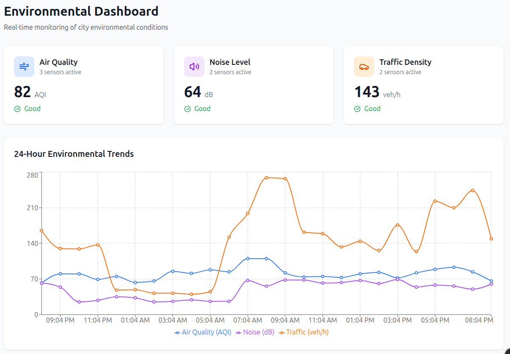
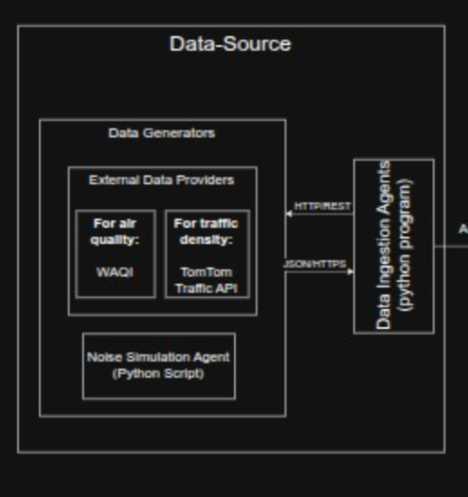
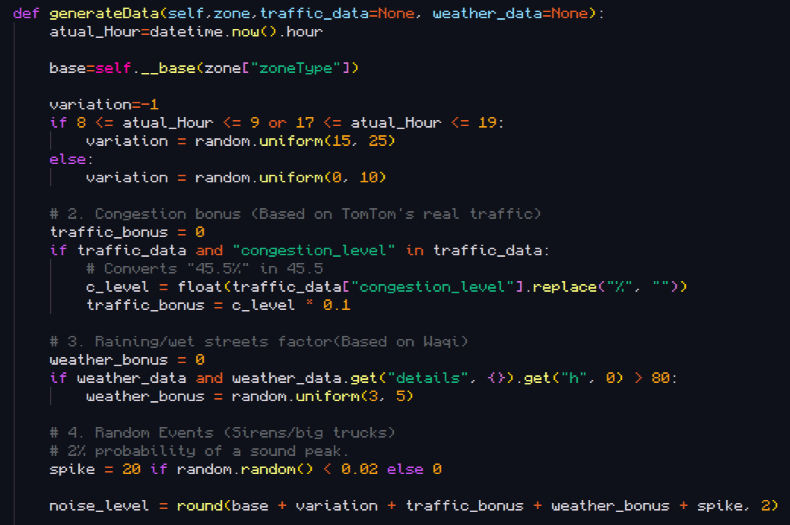
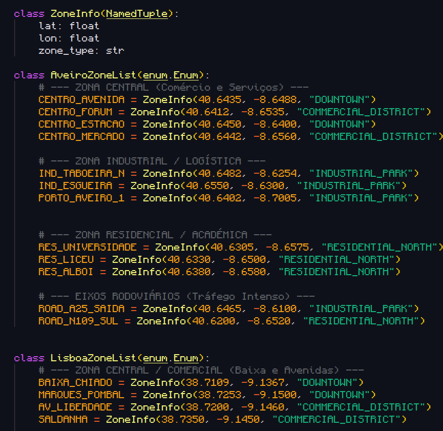
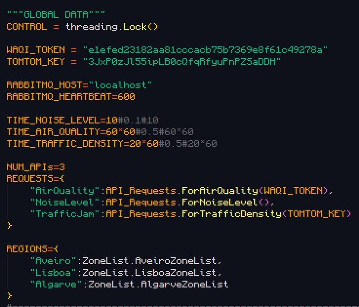
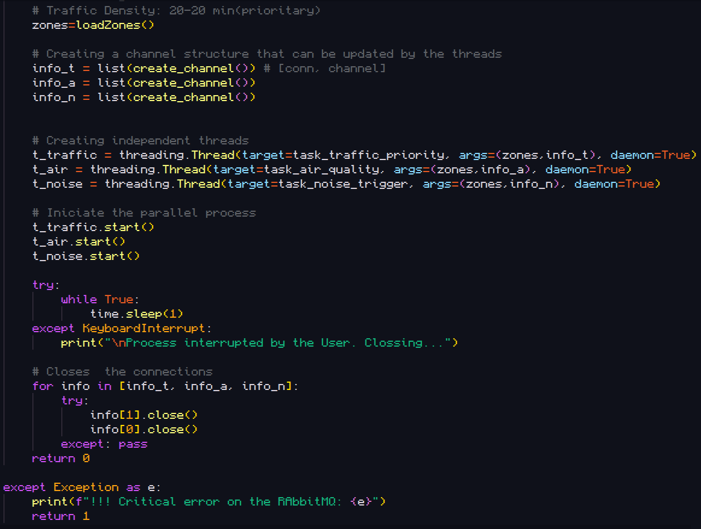

# DATA-SOURCE- v 1.0
## Introduction
* This is a part of a project will be a application for monitoring the a city as the objective to help the governants, urban planners etc to make better sustainable decisions for envolving the city. 



* For this particulary block is the base block, that will be responsible for getting all the data from the sensors(APIs and simulators) and send it to the backend wich it is responsible for processing that data to give to the User(Frontend).The following poins is the user(or part of them) that we will start to developing:

    * US1 - As a City Environmental Manager, I want to view the current air quality, noise level and traƯic density, so that I can quickly assess the city's environmental conditions. 

    * US5 - As an Urban Planner, I want to compare environmental data across diferent city zones, so that I can support sustainable planning decisions.

    * US7 - As a System Administrator, I want to register new sensors in the platform so that they can start publishing data.  

    * US9 - As a System Administrator, I want to view the operational status of sensors, so that I can detect inactive or malfunctioning devices. 

    * US11 - As the system, I want to process incoming sensor data streams in real time, so that relevant events can be detected immediately. 

* After taking this user stories i try to translate them for the relevant parts for this block, wich are the followings:

    * 1-Data ingestion: Extract at least noise Level, air quality and traffic density data in real time

    * 2-Comparation: The data is divided by several zoneType to allow the comparation

    * 3-Scalability: This block needs to allow to be easy to add more zones or new sensors

    * 4-Sensor management: The User(System_Administrator) must be alloy to add and remore sensors without going to the source code

## Data send to RABBIT-MQ

#### Air-Quality:
```
    {
        id: centro_avenida
        Name: Esgueira    
        Region: Aveiro 
        Coords: {           
            Lat: 40.648
            Lon: -8.625
        }
        ZoneType: INDUSTRIAL_PARK 
        timestamp: "2026-04-03T20:34:40.571913"
        {
            "type": "AIR_QUALITY",
            "value": 50,
            "unit": "AQI-index",
            "details": {
                "pm25": 50,
                "pm10": 30,
                "no2": 4.2,
                "so2": 0,
                "t": 17,
                "h": 63
            },
            "forecast": [],
            "station_name": "Sobreiras-Lordelo do Ouro, Porto, Portugal"
        }
    }
```

#### Noise Level:

```
    {
        id: centro_avenida
        Name: Esgueira    
        Region: Aveiro 
        Coords: {           
            Lat: 40.648
            Lon: -8.625
        }
        ZoneType: INDUSTRIAL_PARK 
        timestamp: "2026-04-03T20:34:40.571913"
        Data: {
            "type": "NOISE",
            "value": noise_level,
            "unit": "dB",
            "is_anomaly": spike, 
        }
    }
```

#### Traffic Density

```
{
    id: centro_avenida
    Name: Esgueira    
    Region: Aveiro 
    Coords: {           
        Lat: 40.648
        Lon: -8.625
    }
    ZoneType: INDUSTRIAL_PARK 
    timestamp: "2026-04-03T20:34:40.571913"
    {
        "type": "TRAFFIC",
        "current_speed": 46,
        "free_flow_speed": 46,
        "congestion_level": "0%",
        "travel_delay_seconds": 0,
        "data_confidence": 1,
        "unit": "km/h",
    }
}
```

## Requirments-Developing
* Here i will show what I did to respect each requirement

### 1-Data Ingestion

* For this requirment i build, as i show before, different documents for each type of data needed. Inside of each API's data i get some more details for the general user can see more detailed data.



#### API's

* For each data type i get from real sensors through a HTTP request for this public APIs that monitor the city.

##### Air-Quality

* I used WAQI to obtain this data. WAQI is a project that get data about the air quality from several stations around the globe and shows a index after evaluating the conditions. It gives more detail data too like the abundance of each particle size(pm25,pm10), each gas(nitrogen dioxide and sulfur dioxide), temperature and humidity. It also shows the prevision for at least the next 3 days the max and min of each data.


##### Traffic Density

* To obtain this i used Tom Tom where we can get data about the traffic of each street. It shows the medium speed, if there is any delay, etc


##### Noise level

* For Noise level we couldn't find any trustble API that can be scaled so i made a simulator. The simulator is based on the hours(for example there is more noise during afternoon and less during the night), and base on real data obtained using WAQI and TOM TOM, to simulate the cars noise and the rain.



* To the part of Real time i put 3 threats(one for each data type) so the program can send difertents types of data independently so that the data is always send in time

### 2-Comparation 

* To achieve this requirment i put a camp in all APIs to indicates the zone type and the noise level simulator can generate diferents vallues for each zone type

### 3-Scalability

* This is one of the most complexs requirments where i have to basically facilitate when i want to add new zones or regions or sensors manually and doing all this without affecting or at least mitigating, the response time. For making this, put on a separed python file where i have the enums(divided by region) with the several zones and their coordinates and type



* I made a dicionary too to add new Regions and variable to control the timing to sent othe RABBIT-MQ



* Finally for mitigating the response time i made for example instead of each new data we get, we open the queue(Rabbit MQ) and send it and then close, i only open once and close in two situations, in case we dont have any new update in HEARTBEAT seconds or the user closes the program. I open 3 diferent channel for each threat with the goal of not having to wait for other threats to send their new updates.



### 4-Sensor management


* Finally for the most complex requirment, unfortually, i still havent found any way to do it without being like manually open the source code and changing the variable etc


###### Name: João Neves - 124834


    
# Data-Source-IES-124834
